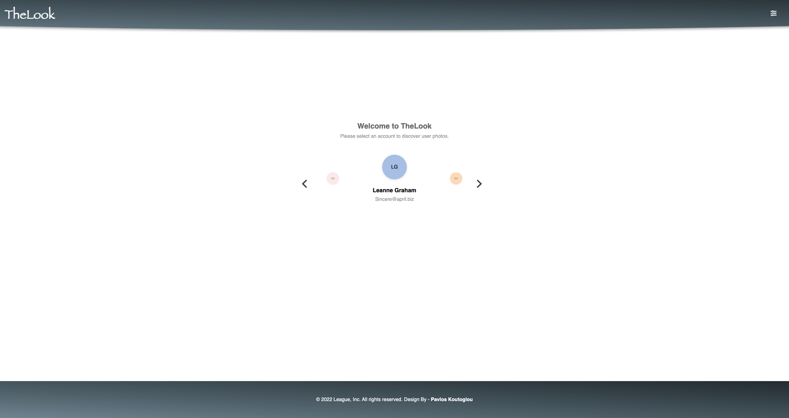
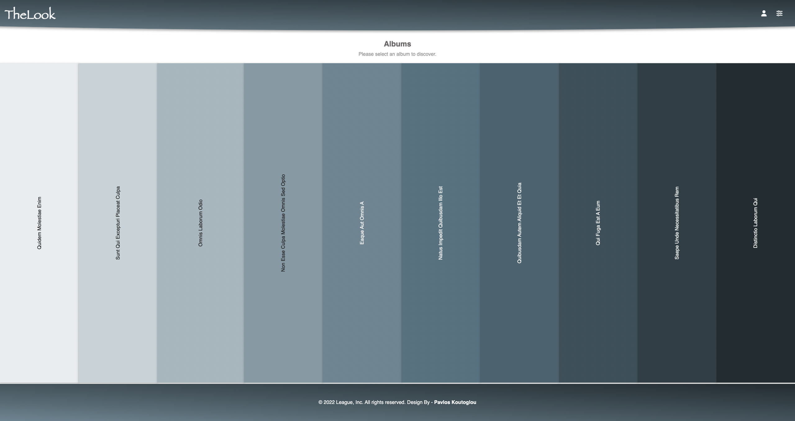
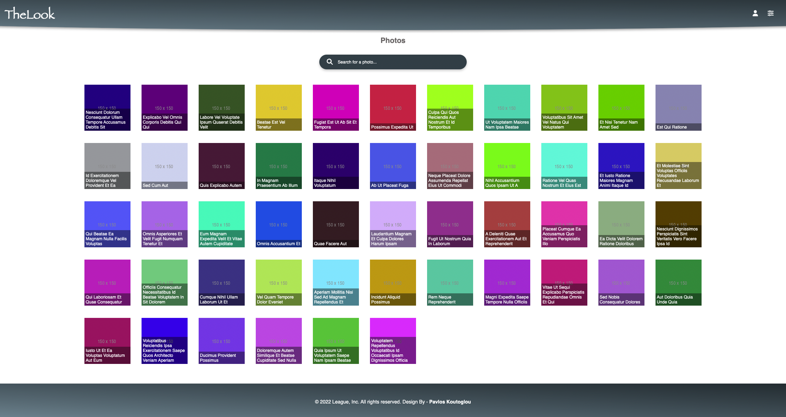
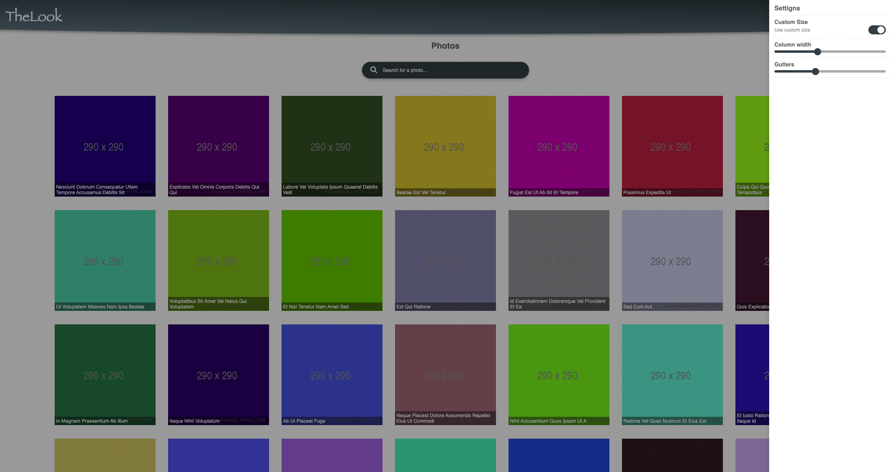

# Overview









This is a photo album app

# Demo

You can follow the [link](https://www.pavkout.cloud/) to see the online demo.

## Used Stack

- [TypeScript](https://www.typescriptlang.org/)
- [React](https://reactjs.org/)
- [Next.js](https://nextjs.org/)
- [Styled-components](https://styled-components.com/)

## Photo Album

- [x] Select a user.
- [x] Select an album from user.
- [x] See the photos from selected album.
- [x] Search for an image.
- [x] Highlight the searching title (Added mark, strong and italic style).
- [x] Modify the images style by settings drawer.
- [x] Change gutters.
- [x] Change size of the image.
- [x] Saved the user settings in local storage. (Reload)

## Features

- [x] Mobile Friendly.

## Tests (Jest)

- [x] Test Suites: 4 passed
- [x] Tests: 25 passed

## Getting started

The existing code includes a development environment, and an [API](#api) with product data for you to interact with. The relevant API response types can be found in [src/types.ts](src/types.ts).

### Setup

```sh
yarn install
```

### Running locally

#### Development

Start the project in development mode.

```sh
yarn dev
```

Run all the tests.

```sh
yarn test
```

#### Production

Build and start the project in production mode.

```sh
yarn start
```

## API

Use the following endpoints:

#### `http://jsonplaceholder.typicode.com/users`

#### `http://jsonplaceholder.typicode.com/users/[id]/albums`

#### `http://jsonplaceholder.typicode.com/albums/[id]/photos`
